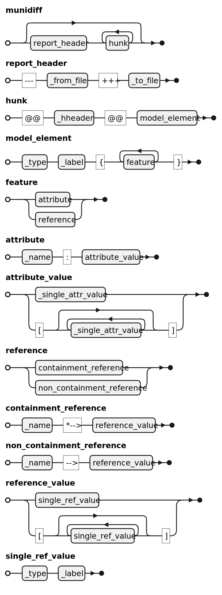

# Munidiff Demo

This demonstration project showcases Munidiff reports in different scenarios.

## Demo contents

- `slides`: materials used to generate the [slides](slides/munidiff.pdf)
- `metamodel`: Ecore metamodel to which models of the scenarios conform to (also in [Emfatic](https://www.eclipse.org/emfatic/) notation)
- `scenarios`: each subfolder contains a concrete comparison scenario with several files:
    - `from.model`: the original model version
    - `to.model`: the new version with changes applied
    - `.diff`: resulting diff reports in Munidif as well as plain XMI
- `scenarios/spoilers.md`: contains descriptions of the objectives behind every scenario.
- `run_scenarios.sh`: generates the `.diff` reports
- `clean.sh`: removes any `.diff` file in the project

## How to (re)generate the diff/munidiff reports

By default the `.diff` files have been included in the repository. If you want to re-generate them though, follow the steps below:

1. Navigate to the `org.eclipse.epsilon.modiff` folder and run `mvn clean verify` (this generates an executable `modiff.jar` to perform the model comparisons)
2. Go back to `org.eclipse.epsilon.modiff.demo` and run `./run_scenarios.sh`
3. The `.diff` files for each scenario should be available on the folder of each scenario.

## Munidiff syntax

