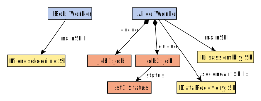

<!-- _paginate: false -->

<style scoped>
p {
    font-size: 28pt;
}
</style>

# Towards an Interoperable and Customisable Textual Format for Model Differences Reporting

<br>

Alfonso de la Vega (alfonso.delavega@unican.es)
Software Engineering and Real-Time Group
Universidad de Cantabria

---

# Two-Way Model Comparison

<style scoped>

</style>

<br>


---

# Two-Way Model Comparison: Stages

1. Comparison
2. Differences Representation
3. Differences **Reporting**

<!-- _footer: Kolovos et al. Different models for model matching: An analysis of approaches to support model differencing -->

---

# Example: Repair Shop (metamodel)


---

# from.model



---

# to.model


---

# Graphical diff

The *job1* job moves from Alice's queue to Bob's


---

# Why textual diff is not as popular?

---

# Why textual diff is not as popular? XMI example

Remember: the only change is *job1* moving from Alice's to Bob's queue

```diff
$ diff -u from.model to.model
--- from.model
+++ to.model
@@ -6,6 +6,11 @@
   <workers name="Alice"
       mainSkill="Disassembly"
       secondarySkills="Microsoldering DataRecovery">
+    <queue jobId="job2"
+        description="broken phone screen"/>
+  </workers>
+  <workers name="Bob"
+      mainSkill="Microsoldering">
     <queue jobId="job1"
         description="laptop does not charge">
       <tags>battery</tags>
@@ -14,11 +19,7 @@
           statusId="st1"
           status="pending"/>
     </queue>
-    <queue jobId="job2"
-        description="broken phone screen"/>
   </workers>
-  <workers name="Bob"
-      mainSkill="Microsoldering"/>
   <skills name="Microsoldering"/>
   <skills name="Disassembly"/>
   <skills name="DataRecovery"/>
```

---

# Can we do better than XMI diffs? Munidiff format

```diff
--- from.model
+++ to.model
@@ @@
 Worker "Bob" {
     queue *-->  [
+        Job "job1"
     ]
 }
@@ @@
 Worker "Alice" {
     queue *-->  [
-        Job "job1"
         Job "job2"
     ]
 }
```

---

# Why bother? Unified Format Support in VCSs
