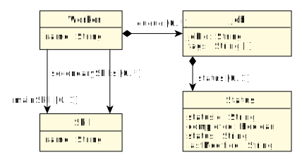

<!-- _paginate: false -->

<style scoped>
p {
    font-size: 28pt;
}
</style>

# Towards an Interoperable and Customisable Textual Format for Model Differences Reporting

<br>

Alfonso de la Vega (alfonso.delavega@unican.es)
Software Engineering and Real-Time Group
Universidad de Cantabria

---

# Two-Way Model Comparison

<br>


---

# Two-Way Model Comparison: Stages

1. Comparison
2. Differences Representation
3. <span class="good">Differences Reporting</span>

<!-- _footer: Kolovos et al. Different models for model matching: An analysis of approaches to support model differencing -->

---

# Example: Repair Shop (metamodel)



---

# from.model


---

# to.model (with changes)


---

# Graphical diff

The *job1* job has moved from Alice's queue to Bob's


---

# Tree-based graphical diff: EMF Compare


---

# What about plain textual diff?

If there is a custom concrete textual syntax (e.g. Xtext-based) -> <span class="good">Probably great!</span>

<br>

**If no** concrete textual syntax -> <span class="alert">diff the persistence format?</span>

---

# What about plain textual diff? XMI example

Remember: the only change is *job1* moving from Alice's to Bob's queue

```diff
$ diff -u from.model to.model
--- from.model
+++ to.model
@@ -6,6 +6,11 @@
   <workers name="Alice"
       mainSkill="Disassembly"
       secondarySkills="Microsoldering DataRecovery">
+    <queue jobId="job2"
+        description="broken phone screen"/>
+  </workers>
+  <workers name="Bob"
+      mainSkill="Microsoldering">
     <queue jobId="job1"
         description="laptop does not charge">
       <tags>battery</tags>
@@ -14,11 +19,7 @@
           statusId="st1"
           status="pending"/>
     </queue>
-    <queue jobId="job2"
-        description="broken phone screen"/>
   </workers>
-  <workers name="Bob"
-      mainSkill="Microsoldering"/>
   <skills name="Microsoldering"/>
   <skills name="Disassembly"/>
   <skills name="DataRecovery"/>
```

---

# Can we do better than XMI diffs? Munidiff format

```diff
--- from.model
+++ to.model
@@ @@
 Worker "Bob" {
     queue *-->  [
+        Job "job1"
     ]
 }
@@ @@
 Worker "Alice" {
     queue *-->  [
-        Job "job1"
         Job "job2"
     ]
 }
```

---


# <!-- fit --> Why bother? Existing support for the Unified Format

- Editors (e.g. Eclipse, Jetbrains, Visual Studio Code)
- Command-Line Interfaces
- Markdown code blocks (these slides)
- Version Control Systems: GitHub, GitLab, Bitbucket
    - Commits, pull requests, issues, user comments

---

# Support Example: GitHub


---

# Munidiff: Unified Diff Format for Models

- Follows the Unified Format
- Can be integrated with any two-way EMF comparison tool
- Currently:
    - EMF Compare (used for the article)
    - *Modiff* (used in this demo, work in progress)

---

# <!-- fit --> How to Use Munidiff: From Model Differences to Text Report

For EMF Compare:
1. Perform the two-way comparison
2. Translate the differences from EMF Compare representation to Munidiff's:


3. Generate a text report from the Munidiff representation

---

# Demo: Find the Differences!

---

# Future Work

- Test different Munidiff flavours
- Exploit the Unified Format (hunk headers? ``@@  @@``)
- Graphical diff visualisations
    - Previous experience: Picto [1]

<!-- footer: "[1] D. Kolovos, A. de la Vega. Efficient generation of graphical model views via lazy model-to-text transformation (MODELS 2020)" -->
